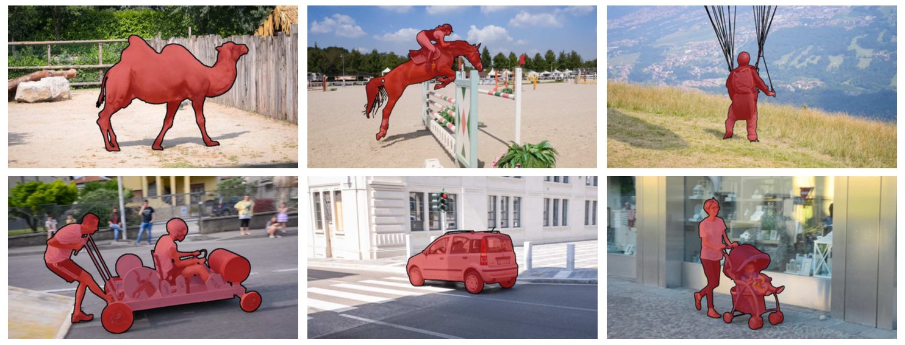

### Code under development. Keep updated to the latest version.

The 2017 DAVIS Challenge on Video Object Segmentation
=====================================================================================

Package containing helper functions for loading and evaluating [DAVIS](https://graphics.ethz.ch/~perazzif/davis/index.html).

A [Matlab](https://github.com/jponttuset/davis-matlab) version of the same package is also available.

Terms of Use
--------------
DAVIS is released under the BSD License (see [LICENSE](LICENSE) for details)

Introduction
--------------
[DAVIS](https://graphics.ethz.ch/~perazzif/davis/index.html) (Densely Annotated VIdeo Segmentation), consists of high quality, Full HD video sequences, spanning multiple occurrences of common video object segmentation challenges such as occlusions, motion-blur and appearance changes. Each video is accompanied by densely annotated, pixel-accurate and per-frame ground truth segmentation.

Code Usage
--------------

### Evaluate
In order to evaluate your results, execute the script `ROOT/python/tools/eval.py` providing the segmentation and setting the correct phase (train,val etc...) and year (2016,2017).

* The evaluation on the 2016 dataset can be done either as single object (ver. 2016) or on multiple objects (ver. 2017, **default**). For single object evaluation set the flag: `-single-object`.

#### Evaluate your results on the {year} dataset (ver. 2017, multiple objects):
`python tools/eval.py -i path-to-my-technique -o results.yaml --year {year} --phase val`

#### Evaluate your results as in 2016 with single objects (ver. 2016)
`python tools/eval.py -i path-to-my-technique -o results.yaml --year 2016 --single-object --phase val`

### Read and write
Annotations are provided in PNG indexed format. We provide helper functions to read and write individual images:

* `davis.io.imread_indexed(filename)`
* `davis.io.imwrite_indexed(filename,array)`

Note that for a correct evaluation of the results, it is critical to preserve the same labeling of the annotations, *i.e.* assign identical numbers to corresponding objects.

See `experiments/read_write_segmentation.py` for usage examples

### Visualize
Execute the script `ROOT/python/tools/visualize.py`. The command-line arguments are similar to the evaluation script. Use `--single-object` to visualize the original DAVIS 2016.

Example: `python tools/visualize.py -i path-to-my-technique --year 2017 --phase val`

Dependencies
------------
C++
* [Boost.Python](https://github.com/ndarray/Boost.NumPy.git)

Python
 * See ROOT/python/requirements.txt (Optionally to visualize results install `cv2`)

Installation
--------------
C++

1. ./configure.sh && make -C build/release

Python:

1. pip install virtualenv virtualenvwrapper
2. source /usr/local/bin/virtualenvwrapper.sh
3. mkvirtualenv davis
4. pip install -r python/requirements.txt
5. export PYTHONPATH=$(pwd)/python/lib
6. See ROOT/python/lib/davis/config.py for a list of available options

Documentation
----------------
The directory is structured as follows:

 * `ROOT/cpp`: Implementation and python wrapper of the temporal stability measure.

 * `ROOT/python/tools`: contains scripts for evaluating segmentation.
     - `eval.py` : evaluate a technique and store results in HDF5 file
     - `eval_view.py`: read and display evaluation from HDF5.
     - `visualize.py`: visualize segmentation results.

 * `ROOT/python/lib/davis`  : library package contains helper functions for parsing and evaluating DAVIS

 * `ROOT/data` :
     - `get_davis.sh`: download input images and annotations.

See source code for API documentation.

Citation
--------------

Please cite `DAVIS` in your publications if it helps your research:

    @inproceedings{Perazzi_CVPR_2016,
      author    = {Federico Perazzi and
                   Jordi Pont-Tuset and
                   Brian McWilliams and
                   Luc Van Gool and
                   Markus Gross and
                   Alexander Sorkine-Hornung},
      title     = {A Benchmark Dataset and Evaluation Methodology for Video Object Segmentation},
      booktitle = {The IEEE Conference on Computer Vision and Pattern Recognition (CVPR)},
      year      = {2016}
    }

    @article{Pont-Tuset_arXiv_2017,
      author  = {Jordi Pont-Tuset and
                 Federico Perazzi and
                 Sergi Caelles and
                 Pablo Arbel\'aez and
                 Alexander Sorkine-Hornung and
                 Luc {Van Gool}},
      title   = {The 2017 DAVIS Challenge on Video Object Segmentation},
      journal = {arXiv:1704.00675},
      year    = {2017}
    }

Contacts
------------------
- [Federico Perazzi](https://graphics.ethz.ch/~perazzif)
- [Jordi Pont-Tuset](http://jponttuset.github.io)

TODOs
----------------
  - [ ] Temporal stability measure (T)
  - [ ] Per-attribute evaluation script
  - [ ] Add usage examples

